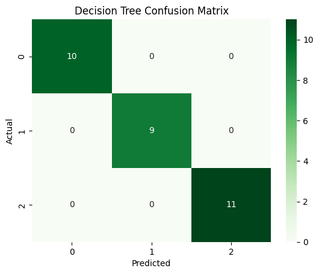
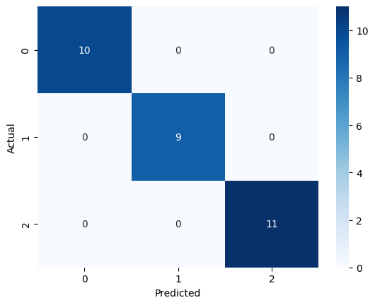
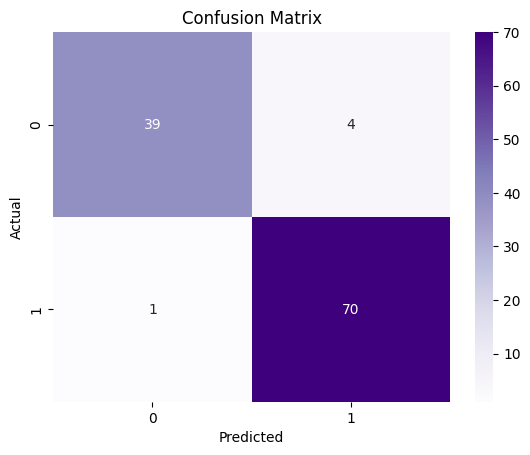
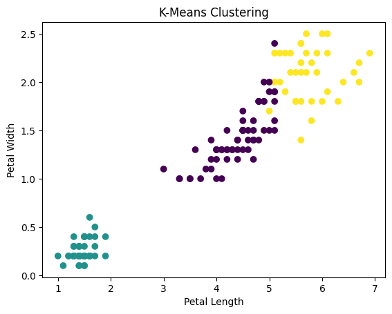
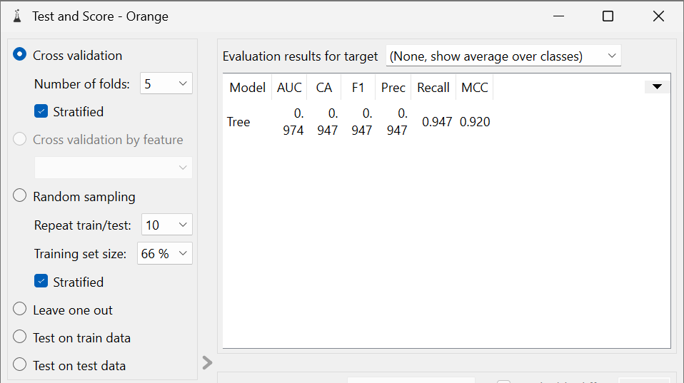

# 🧠 Data Mining Lab

A practical implementation of core data mining techniques including classification, clustering, and association rule mining using Python and GUI-based tools.

---

## 🚀 Project Overview

This project covers:

*  Classification using Iris dataset
*  Classification using Breast Cancer dataset
*  Clustering using K-Means
*  Association Rule Mining using Apriori
*  ORANGE (visual ML workflows)
*  WEKA (GUI-based ML tool)

---

## 📁 Project Structure

```
data-mining-lab/
│
├── notebooks/
│   ├── 01_iris_classification.ipynb
│   ├── 02_breast_cancer_classification.ipynb
│   ├── 03_clustering.ipynb
│   └── 04_association_rules.ipynb
│
├── results/
│   └── plots/
│
├── orange/
│   ├── screenshots/
│   └── notes.md
│
├── weka/
│   ├── screenshots/
│   └── notes.md
│
└── README.md
```

---

## 🌸 Iris Classification

* Models: KNN, Decision Tree
* Accuracy: **100%**

### 📊 Output




### 🧠 Insight

The dataset is well-separated, allowing multiple models to achieve perfect accuracy.

---

## 🧬 Breast Cancer Classification

* Model: Logistic Regression
* Accuracy: **~96%**

### 📊 Output



### 🧠 Insight

Precision, recall, and F1-score provide better understanding than accuracy alone for real-world datasets.

---

## 🌀 Clustering (K-Means)

* Optimal clusters: **3**
* Silhouette Score: **~0.55**

### 📊 Output



### 🧠 Insight

Even without labels, natural groupings emerge from the data.

---

## 🔗 Association Rules (Apriori)

* Custom market basket dataset used
* Example rule:

  *  Milk →  Bread

### 🧠 Insight

Association rules reveal relationships between items and can be applied in recommendation systems.

---

## 🟠 ORANGE Workflow

Used ORANGE to build a visual machine learning pipeline.

### 📸 Screenshot




---

## 🔵 WEKA Experiment

Used WEKA Explorer to perform classification using J48 (Decision Tree).

### 📸 Screenshot


---

## 🛠️ Technologies Used

* Python
* Pandas, NumPy
* Scikit-learn
* Matplotlib, Seaborn
* Mlxtend
* ORANGE
* WEKA

---

## 📊 Key Learnings

* Different algorithms perform differently based on dataset complexity
* Visualization helps understand patterns
* Evaluation metrics are crucial
* Data mining involves both implementation and interpretation

---

## 📌 Future Improvements

* Add more real-world datasets
* Build a simple UI
* Compare additional algorithms

---

## 👨‍💻 Author

* Keerti Lata Choudhury
